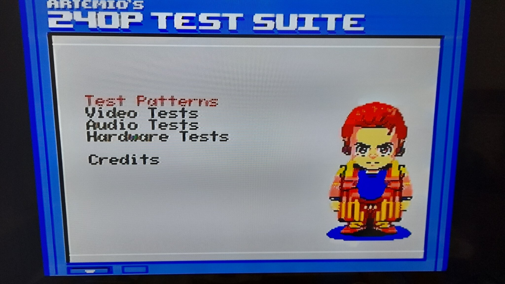
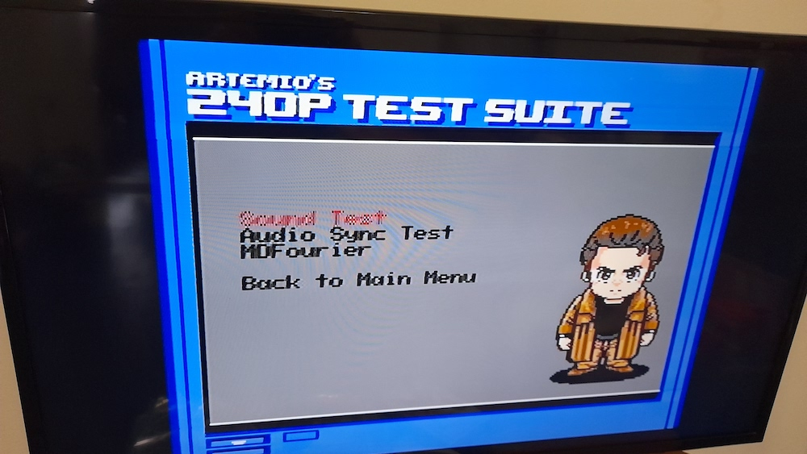

# 240pTestSuite_colecovision

### What is this?

This is a port of the Artemio's 240p Test suite for Colecovision consoles, MSX 1/2/2+ computers, and Sega SG1000 consoles. It is a software suite developed to help in the evaluation of capture cards, upscalers, upscan converters, line doublers, and of course TV processing of 240p video and scaled signals.

The original 240p Test Suite is available at [https://github.com/ArtemioUrbina/240pTestSuite](https://github.com/ArtemioUrbina/240pTestSuite)

More info about the 240p Test Suite is available at [https://junkerhq.net/240p/](https://junkerhq.net/240p/)

### How to use it.

* Colecovision
    * Load the file *suitecv.rom* in your favorite Colecovision emulator (BlueMSX, OpenMSX or CoolCV).
    * Load the file *suitecv.rom* into a flash cartridge like the AtariMAX Ultimate SD Colecovision cartridge.
    * Program the file *suitecv.rom* onto a 32K cartridge PCB.
* MSX 1/2/2+ (SCC mapper)
    * Load the file *suitemsx.rom* in your favorite MSX emulator (BlueMSX, OpenMSX, Meisei, fMSX)
    * Load the file *suitemsx.rom* into a flash cartridge like the MSX MegaFlash SD cartridge or the Carnivore 2 cartridge.
* Sega SG1000.
    * Load the file *suitesg.rom* in your favorite SG1000 emulator (BlueMSX, Meka, CoolCV, etc.)
    * Program the file *suitesg.rom* onto a 32K cartridge PCB.
    
Detailed usage instructions are in the [Suite_manual.md](Suite_manual.md) file.

### How to assemble

For assembling yourself the source code, you require tniASM v0.44 or v0.45 available freely from [http://www.tni.nl/products/tniasm.html](http://www.tni.nl/products/tniasm.html)

You only need to assemble the file suite.asm and it includes all the other required files (edit the COLECO, MSX or SG1000 label accordingly).

There are some batch files coming from the development environment (WinXP) that create the required images (images.bat) and assemble the code (e.bat).

Other utilities required are Pletter to compress the VDP data, and TMSColor to convert the bitmaps to the VDP format. Both are included in source code form.

===============================================================================
Original 240p Test Suite is © Copyright 2011-2021 Artemio Urbina

Colecovision/MSX/SG1000 version is © Copyright 2023-2024 Oscar Toledo G.

This program is free software; you can redistribute it and/or modify it under the terms of the GNU General Public License as published by the Free Software Foundation; either version 2 of the License, or (at your option) any later version.

This program is distributed in the hope that it will be useful, but WITHOUT ANY WARRANTY; without even the implied warranty of MERCHANTABILITY or FITNESS FOR A PARTICULAR PURPOSE. See the GNU General Public License for more details.

You should have received a copy of the GNU General Public License along with this program; if not, write to the Free Software Foundation, Inc., 51 Franklin Street, Fifth Floor, Boston, MA 02110-1301 USA.
